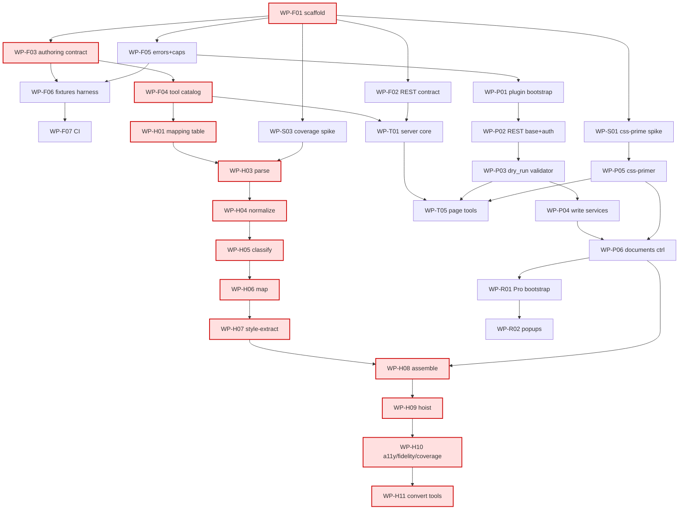

# BUILD-PLAN — ULTRA Elementor MCP

> Build orchestration layer. Derived mechanically from the 75 work-package frontmatters under
> `spec/work-packages/` and consolidated into the machine-readable index `spec/work-packages.json`.
> This document is the human-readable companion: the dependency DAG, the wave table, the proven
> file-disjoint parallel batches, the milestone mapping, the spike gates, and the launch protocol.
>
> Regenerate with `node spec/.compute-dag.mjs` (writes `spec/work-packages.json` + `spec/.dag-meta.json`).
> If a WP frontmatter changes (deps or files_owned), re-run it and re-derive this plan.

---

## 0. Validation report (run this FIRST, fix before launching any wave)

The DAG was validated against three failure classes. Current status:

| Check | Result |
| --- | --- |
| Dependency CYCLES | **NONE** (DFS over 75 nodes, all gray-edge sets empty) |
| Dependency on an UNDEFINED WP ID | **NONE** (every `depends_on` entry resolves to a manifest id) |
| Two same-wave WPs sharing a `files_owned` path (HARD, exact path) | **NONE** |
| Two same-wave WPs overlapping via glob/prefix (SOFT) | **NONE** |

**Conclusion:** the DAG is acyclic, fully resolved, and every wave is internally file-disjoint —
so for every wave, the parallel batch == the entire wave. No finalize-stage conflict fixes required.

**The disjointness proof runs on the EXACT files workers materialize.** Every `files_owned` entry in
`spec/work-packages.json` is now an explicit, concrete path — there are NO globs, prefixes, or
parenthetical carve-out notes anywhere in the manifest. The manifest is byte-consistent with each WP
file's frontmatter (verified: `files_owned` and `depends_on` match for all 75 WPs), so the HARD/SOFT
overlap proof certifies the same artifact build workers obey. Global double-ownership = 0; intra-wave
collisions = 0; glob/paren entries = 0; every `parallel_group == "W"+wave`.

Notes for the finalize/assembler stage (no carve-outs remain — these are just provenance):
- `WP-Q03` owns the 16 non-Pro lean smoke envelopes by EXPLICIT filename (e.g.
  `smoke.elementor.page.build.json`); the 2 `convert.*` envelopes are owned by `WP-H12` (wave 3) and the
  6 `smoke.elementor.pro.*.json` envelopes are each owned by exactly one Pro TS WP — `WP-R07` (theme),
  `WP-R08` (popup), `WP-R09` (form), `WP-R10` (loop), `WP-R11` (dynamic), `WP-R12` (woo) — all distinct
  filenames. Because Q03 enumerates explicit names (NOT a `smoke.elementor.*.json` glob), it does NOT
  match the `convert.*` or `pro.*` envelopes; there is nothing to carve out. (Earlier drafts used a glob
  that fnmatch-matched the 2 convert + 6 pro envelopes; that glob is gone.)
- `WP-Q01` owns its 19 golden-tree fixtures by EXPLICIT filename; `WP-Q06` owns the two named
  `render-assert.hero.json` / `render-assert.global-class.json` (+ `trees/INDEX-render.md`). They share
  the `trees/v4/valid/` DIRECTORY but no FILE, and are in different waves (5 vs 6). No glob to keep
  carved — the explicit lists are disjoint by construction.
- `WP-F06` (wave 2) seeds the 9 fixtures subdirectories with explicit `.gitkeep` files (now in the
  manifest); later WPs (`WP-H12` w3, `WP-Q03` w4, `WP-Q01`/`WP-Q05` w5, etc.) add real files into those
  dirs in LATER waves — disjoint by both wave-order and explicit filename. The `.gitkeep` paths are
  enumerated in the manifest so the disjointness checker sees them.

---

## 1. Summary

- **Total work packages:** 75
- **Waves:** 13 (wave 0 .. wave 12)
- **Critical path length:** 13 WPs (the HTML→native pipeline)
- **Critical path:** `WP-F01 → WP-F03 → WP-F04 → WP-H01 → WP-H03 → WP-H04 → WP-H05 → WP-H06 → WP-H07 → WP-H08 → WP-H09 → WP-H10 → WP-H11`
- **Critical path estimate-weight:** 35 (S=1, M=2, L=3) — the longest *and* heaviest chain.
- **Layer counts:** foundation 7, spike 7, php 22, ts 19, html 12, qa 8.
- **Phase counts:** foundation 17, MVP 17, v1 24, ULTRA 17.

The whole graph hangs off a single root (`WP-F01`, the monorepo scaffold). After that the graph
fans out wide: wave 1 alone has 10 parallel-safe WPs, and waves 4 and 6 each have 12. The narrow
tail (waves 10-12, one WP each) is the strictly-sequential back half of the HTML pipeline
(`hoist → a11y/fidelity/coverage → convert tools`), which is the true schedule bottleneck.

---

## 2. Dependency DAG

### 2.1 Adjacency list (WP → direct dependencies)

```
WP-F01  ->  (none, root)
WP-F02  ->  WP-F01
WP-F03  ->  WP-F01
WP-F04  ->  WP-F01, WP-F03
WP-F05  ->  WP-F01
WP-F06  ->  WP-F01, WP-F03, WP-F05
WP-F07  ->  WP-F01, WP-F06
WP-S01  ->  WP-F01
WP-S02  ->  WP-F01
WP-S03  ->  WP-F01, WP-F03
WP-S04  ->  WP-F01
WP-S05  ->  WP-F01
WP-S06  ->  WP-F01
WP-S07  ->  WP-F01
WP-P01  ->  WP-F05
WP-P02  ->  WP-P01, WP-F05
WP-P03  ->  WP-P01, WP-P02, WP-F03, WP-F05
WP-P04  ->  WP-P01, WP-P02, WP-P03
WP-P05  ->  WP-P01, WP-P02, WP-S01
WP-P06  ->  WP-P02, WP-P03, WP-P04, WP-P05, WP-S01
WP-P07  ->  WP-P01, WP-P02
WP-P08  ->  WP-P02, WP-P03, WP-P05, WP-S05
WP-P09  ->  WP-P02, WP-P03, WP-P05, WP-P08, WP-S05
WP-P10  ->  WP-P02
WP-P11  ->  WP-P02, WP-P03, WP-P04
WP-P12  ->  WP-P02, WP-P03, WP-P04, WP-P05, WP-P10, WP-S01, WP-S02
WP-P13  ->  WP-P02, WP-P04, WP-P05, WP-S07
WP-P14  ->  WP-P01, WP-P02
WP-P15  ->  WP-P02, WP-P03, WP-P04, WP-P05, WP-S01
WP-P16  ->  WP-P01, WP-P03, WP-P04, WP-P05, WP-P07, WP-S01
WP-T01  ->  WP-F01, WP-F02, WP-F04, WP-F05
WP-T02  ->  WP-F01
WP-T03  ->  WP-F01, WP-F02, WP-F03, WP-P03
WP-T04  ->  WP-F01, WP-F02, WP-F04, WP-F05, WP-T01
WP-T05  ->  WP-F01, WP-F02, WP-F03, WP-F04, WP-T01, WP-T03, WP-P03, WP-P05, WP-S01
WP-T06  ->  WP-F01, WP-F02, WP-F03, WP-F04, WP-T01, WP-T03, WP-P03, WP-P05, WP-S01
WP-T07  ->  WP-F01, WP-F02, WP-F03, WP-F04, WP-F05, WP-T01, WP-T03, WP-P03, WP-P05, WP-P08, WP-P09, WP-S01, WP-S05
WP-T08  ->  WP-F01, WP-F02, WP-F04, WP-F05, WP-T01, WP-P10
WP-T09  ->  WP-F01, WP-F02, WP-F04, WP-F05, WP-T01, WP-T03, WP-P03, WP-P11
WP-T10  ->  WP-F01, WP-F02, WP-F03, WP-F04, WP-F05, WP-T01, WP-T03, WP-P03, WP-P05, WP-P12, WP-P13, WP-S01, WP-S02
WP-T11  ->  WP-F01, WP-F02, WP-F04, WP-F05, WP-T01, WP-T03, WP-P03, WP-P14
WP-T12  ->  WP-F01, WP-F02, WP-F04, WP-F05, WP-T01
WP-T13  ->  WP-F01, WP-F04, WP-T01
WP-H01  ->  WP-F03, WP-F04
WP-H02  ->  WP-F03, WP-H01
WP-H03  ->  WP-F03, WP-H01, WP-S03
WP-H04  ->  WP-F03, WP-H01, WP-H03
WP-H05  ->  WP-F03, WP-H01, WP-H03, WP-H04
WP-H06  ->  WP-F03, WP-H01, WP-H05
WP-H07  ->  WP-F03, WP-F05, WP-P02, WP-P03, WP-P05, WP-H01, WP-H02, WP-H06, WP-S01
WP-H08  ->  WP-F03, WP-F05, WP-P02, WP-P03, WP-P05, WP-P06, WP-H01, WP-H06, WP-H07, WP-S01
WP-H09  ->  WP-F03, WP-F05, WP-P02, WP-P03, WP-P05, WP-H01, WP-H07, WP-H08, WP-S01
WP-H10  ->  WP-F03, WP-F05, WP-F06, WP-P02, WP-P03, WP-P05, WP-H01, WP-H03, WP-H04, WP-H07, WP-H08, WP-H09, WP-S01, WP-S03
WP-H11  ->  WP-F03, WP-F04, WP-F05, WP-T01, WP-T02, WP-P02, WP-P03, WP-P05, WP-P06, WP-H03..WP-H10, WP-S01, WP-S03
WP-H12  ->  WP-F03, WP-F06, WP-S03
WP-R01  ->  WP-F01, WP-F02, WP-F05, WP-P01, WP-P02, WP-P03, WP-P04, WP-P05, WP-P06, WP-S01
WP-R02  ->  ...WP-R01 (+ same P-core as R01)
WP-R03  ->  ...WP-R01 (+ same P-core as R01)
WP-R04  ->  ...WP-R01 (+ same P-core as R01)
WP-R05  ->  WP-F01, WP-F02, WP-F05, WP-P01, WP-P02, WP-P03, WP-P04, WP-P06, WP-P07, WP-R01
WP-R06  ->  ...WP-R01 (+ same P-core as R01)
WP-R07  ->  WP-F01, WP-F03, WP-F04, WP-F05, WP-T01, WP-T04, WP-T05, WP-R01
WP-R08  ->  ...WP-T-core, WP-R02
WP-R09  ->  ...WP-T-core, WP-R03
WP-R10  ->  ...WP-T-core, WP-R04
WP-R11  ->  ...WP-T-core, WP-R05
WP-R12  ->  ...WP-T-core, WP-R06
WP-Q01  ->  WP-F03, WP-F05, WP-F06, WP-P03
WP-Q02  ->  WP-F03, WP-F06
WP-Q03  ->  WP-F04, WP-F06, WP-H12
WP-Q04  ->  WP-F06, WP-S03, WP-P03, WP-H12
WP-Q05  ->  WP-F03, WP-F06, WP-P03
WP-Q06  ->  WP-F06, WP-S01, WP-P03, WP-P04, WP-P05
WP-Q07  ->  WP-F06, WP-S01, WP-P03, WP-P04, WP-P05, WP-Q06
WP-Q08  ->  WP-F01, WP-F07
```

### 2.2 Mermaid (high-level, contract-spine + critical path)



---

## 3. Wave table

`wave = 1 + max(wave of deps)`; root WPs (`depends_on: []`) are wave 0. A WP cannot start until
**all** its dependencies' waves have fully completed. Each wave below is a single proven
file-disjoint parallel batch (parallel group label in the right column).

| Wave | Count | WP IDs | Parallel group | What completing this wave unblocks |
| --- | --- | --- | --- | --- |
| 0 | 1 | WP-F01 | W0 | The entire repo: every other WP transitively depends on the scaffold. |
| 1 | 10 | WP-F02, WP-F03, WP-F05, WP-S01, WP-S02, WP-S04, WP-S05, WP-S06, WP-S07, WP-T02 | W1 | Frozen REST + authoring + error contracts (F02/F03/F05) unblock the tool catalog, fixtures harness, plugin bootstrap, and all spikes land their findings. |
| 2 | 4 | WP-F04, WP-F06, WP-P01, WP-S03 | W2 | Tool catalog (F04) + fixtures harness (F06) + plugin bootstrap (P01) + coverage baseline (S03). Unblocks CI, server core, REST base, mapping table, HTML corpus. |
| 3 | 6 | WP-F07, WP-H01, WP-H12, WP-P02, WP-Q02, WP-T01 | W3 | REST base+auth (P02) opens all PHP controllers/validator; server core (T01) opens all TS tools; mapping table (H01) opens the HTML pipeline; CI (F07) green-gates merges. |
| 4 | 12 | WP-H02, WP-H03, WP-P03, WP-P05, WP-P07, WP-P10, WP-P14, WP-Q03, WP-Q08, WP-T04, WP-T12, WP-T13 | W4 | The AUTHORITATIVE validator (P03) + css-primer (P05) — the two most depended-on PHP services. Parse stage (H03) starts the pipeline tail. |
| 5 | 8 | WP-H04, WP-P04, WP-P08, WP-Q01, WP-Q04, WP-Q05, WP-T03, WP-T08 | W5 | Write services (P04) + global-classes (P08) + safety utils (T03). Unblocks documents controller, page/widget tools, design tools, nav. |
| 6 | 12 | WP-H05, WP-P06, WP-P09, WP-P11, WP-P12, WP-P13, WP-P15, WP-P16, WP-Q06, WP-T05, WP-T06, WP-T11 | W6 | **MVP write surface lands here** (P06 documents ctrl, T05 page, T06 widget). Templates/cache/batch/abilities PHP done. |
| 7 | 6 | WP-H06, WP-Q07, WP-R01, WP-T07, WP-T09, WP-T10 | W7 | Pro PHP bootstrap (R01) opens the Pro PHP fan; design/nav/templates TS tools land (v1 surface). |
| 8 | 7 | WP-H07, WP-R02, WP-R03, WP-R04, WP-R05, WP-R06, WP-R07 | W8 | Pro PHP services (popups/forms/loop/dynamic/woo) + first Pro TS tool (theme R07, which also owns the `theme-builder-from-spec` prompt handler). Style-extract (H07) advances pipeline. |
| 9 | 6 | WP-H08, WP-R08, WP-R09, WP-R10, WP-R11, WP-R12 | W9 | Remaining Pro TS tools; assemble stage (H08). |
| 10 | 1 | WP-H09 | W10 | Hoist/dedup — sole occupant; serial. |
| 11 | 1 | WP-H10 | W11 | A11y + fidelity + coverage + commit gate — sole occupant; serial. |
| 12 | 1 | WP-H11 | W12 | convert.* MCP tools + persist orchestrator — final deliverable of the flagship. |

---

## 4. Parallel batches (proven file-disjoint)

Because every wave was verified to have pairwise-disjoint `files_owned` (Section 0), **each wave is
exactly one parallel batch**. Launch all WPs in a wave concurrently; no two will touch the same file.

| Parallel group | Wave | Members (launch together) | Max concurrency |
| --- | --- | --- | --- |
| W0 | 0 | WP-F01 | 1 |
| W1 | 1 | WP-F02 WP-F03 WP-F05 WP-S01 WP-S02 WP-S04 WP-S05 WP-S06 WP-S07 WP-T02 | 10 |
| W2 | 2 | WP-F04 WP-F06 WP-P01 WP-S03 | 4 |
| W3 | 3 | WP-F07 WP-H01 WP-H12 WP-P02 WP-Q02 WP-T01 | 6 |
| W4 | 4 | WP-H02 WP-H03 WP-P03 WP-P05 WP-P07 WP-P10 WP-P14 WP-Q03 WP-Q08 WP-T04 WP-T12 WP-T13 | 12 |
| W5 | 5 | WP-H04 WP-P04 WP-P08 WP-Q01 WP-Q04 WP-Q05 WP-T03 WP-T08 | 8 |
| W6 | 6 | WP-H05 WP-P06 WP-P09 WP-P11 WP-P12 WP-P13 WP-P15 WP-P16 WP-Q06 WP-T05 WP-T06 WP-T11 | 12 |
| W7 | 7 | WP-H06 WP-Q07 WP-R01 WP-T07 WP-T09 WP-T10 | 6 |
| W8 | 8 | WP-H07 WP-R02 WP-R03 WP-R04 WP-R05 WP-R06 WP-R07 | 7 |
| W9 | 9 | WP-H08 WP-R08 WP-R09 WP-R10 WP-R11 WP-R12 | 6 |
| W10 | 10 | WP-H09 | 1 |
| W11 | 11 | WP-H10 | 1 |
| W12 | 12 | WP-H11 | 1 |

**Throughput note.** The wide waves (1, 4, 6) let you spend 10-12 parallel build workflows; the
tail (10-12) is strictly serial regardless of worker count. If you must shorten wall-clock, the only
lever is the HTML pipeline chain `H06→H07→H08→H09→H10→H11` — none of these can be parallelized with
each other because each consumes the previous stage's output and they share the `packages/server/src/convert/`
module boundary by stage. Consider starting the HTML chain's early stages (H01→H06) as soon as wave 3
opens, in a dedicated worker, so the pipeline is not gated behind the broad MVP waves.

---

## 5. Milestone mapping (MVP / v1 / ULTRA)

Each WP carries a `phase` in its frontmatter. A milestone is "buildable" once every WP of that phase
*and all of its transitive dependencies* have completed. Milestone frontiers (the latest wave that
contains a WP of that phase):

| Milestone | WP count | Completes at wave | Last WPs of the milestone |
| --- | --- | --- | --- |
| foundation | 17 | wave 3 | WP-F07, WP-P02, WP-Q02 |
| MVP | 17 | wave 6 | WP-P06, WP-P13, WP-Q06, WP-T05, WP-T06 |
| v1 | 24 | wave 12 | WP-H11 (the flagship convert tools) |
| ULTRA | 17 | wave 11 | WP-H10 (a11y/fidelity/coverage) |

### 5.1 foundation (waves 0-3)
`WP-F01..F07`, all 7 spikes `WP-S01..S07`, `WP-P01`, `WP-P02`, `WP-Q02`. This is the contract spine
+ de-risking. Nothing ships, but every frozen contract and every spike verdict the rest of the build
depends on is produced here. **Do not start any MVP write WP until foundation contracts F02/F03/F05
are frozen (wave 1) and the validator's upstream (P02) is in.**

### 5.2 MVP (frontier wave 6) — the headless build/edit core
17 WPs: PHP `P03,P04,P05,P06,P07,P10,P13`; TS `T01..T06` (page+widget+discovery+safety+transport);
QA `Q01,Q03,Q05,Q06`. Outcome: an agent can create a page, build/replace its atomic tree, edit
widgets, run the authoritative dry_run, prime CSS so the page renders, and roll back — proven by the
S01 render-assertion regression (`WP-Q06`) and round-trip identity (`WP-Q05`).

### 5.3 v1 (frontier wave 12) — design system + media + nav + templates + HTML flagship
24 WPs: PHP `P08,P09,P11,P12,P14`; TS `T07..T13`; the **entire HTML pipeline** `H01..H12`; QA
`Q04,Q08`. The HTML→native flagship (`WP-H11`) is the last thing to land and defines the v1 frontier
at wave 12. v1 is "feature complete for the agency core + migration".

### 5.4 ULTRA (frontier wave 11) — Pro surface + batch + abilities + a11y/fidelity gate
17 WPs: PHP `P15` (batch), `P16` (abilities), `R01..R06` (Pro PHP); TS `T11` (ops/batch/meta),
`R07..R12` (Pro TS); HTML `H10` (a11y/fidelity/coverage commit gate); QA `Q07` (e2e agency site).
WooCommerce ships here as the context-validated `add_widget` only (`WP-R06`/`WP-R12`), per the locked
deferral. Note ULTRA's frontier (wave 11) is *earlier* than v1's (wave 12) only because the single
v1 flagship tool `WP-H11` sits one wave beyond the a11y/coverage gate it depends on.

---

## 6. Spike gates (which waves are blocked until which spike passes)

Spikes land in wave 1 (S01,S02,S04,S05,S06,S07) and wave 2 (S03, which needs F03). A spike is a
**hard gate**: dependent WPs must not begin until the spike has a recorded PASS verdict in
`spec/spikes/<ID>-*.md`. If a spike FAILS, its dependents are blocked pending the spike's documented
fallback.

| Spike | Verdict needed before | Blocks (direct dependents) | Phase impact if it fails |
| --- | --- | --- | --- |
| **WP-S01** headless atomic save + CSS priming | wave 4 (P05) | P05, P06, P12, P15, P16, T05, T06, T07, T10, Q06, Q07, R01-R06, H07, H08, H09, H10, H11 | **Highest-leverage gate.** Atomic CSS does not render on a headless save; the whole atomic write+render path and the entire HTML pipeline tail depend on the chosen prime-css approach. A failure forces V3-only authoring or an alternate prime mechanism. |
| **WP-S03** HTML→native coverage baseline | wave 3 (H12), wave 4 (H03) | H03, H12, Q04, H10, H11 | Sets the "S3 number" — the coverage threshold the flagship and its regression suite assert against. Failure re-scopes the HTML pipeline's acceptance bar. |
| **WP-S02** template-library atomic save | wave 6 (P12) | P12, T10 | Templates/kits surface. Failure narrows template save/import to V3 or defers V4 template round-trip. |
| **WP-S05** UPDATE_CLASS capability presence | wave 5 (P08) | P08, P09, T07 | Global-classes write path. The plugin grants UPDATE_CLASS idempotently on activation; this spike confirms the grant reaches the agent user. Failure blocks the design-system class surface. |
| **WP-S07** flush-css --network multisite | wave 6 (P13) | P13 | Cache controller's network flush. Failure forces per-site flush loop on multisite. |
| **WP-S04** save_settings merge semantics | (informs P06/T05 design) | none direct | Decides merge-vs-replace for `page.update_settings`. No hard block, but a wrong assumption silently corrupts settings — treat as a design input to P06/T05. |
| **WP-S06** App-Password over HTTP | (informs P02/T-core auth) | none direct | Confirms the local auth path works over plain HTTP on LocalWP/wp-env. No hard block in the DAG, but a failure invalidates the entire deployment auth model — treat as a **go/no-go** for the whole project, run it first. |

**Operational rule:** open wave 1 with **all spikes prioritized**. Even the two spikes that block no
WP directly (S04, S06) are go/no-go design inputs — record their verdicts before wave 4.

---

## 7. Critical path

```
WP-F01 → WP-F03 → WP-F04 → WP-H01 → WP-H03 → WP-H04 → WP-H05 → WP-H06 → WP-H07 → WP-H08 → WP-H09 → WP-H10 → WP-H11
(scaffold) (authoring) (catalog) (mapping) (parse) (norm) (classify) (map) (style) (assemble) (hoist) (a11y/fid/cov) (tools)
```

13 WPs, estimate-weight 35. This is the HTML→native conversion pipeline plus its three frozen-contract
ancestors. It is the schedule bottleneck because stages H03→H11 are inherently sequential (each stage
consumes the previous stage's IR) and the late stages each occupy a wave alone. To compress wall-clock,
dedicate a worker to the HTML chain the moment wave 3 opens and keep it staffed continuously; do not
let it queue behind the broad MVP waves.

Secondary near-critical chains to watch (they re-converge into H08+):
- PHP spine: `WP-F01 → WP-F05 → WP-P01 → WP-P02 → WP-P03 → WP-P04 → WP-P06 → WP-H08` (8) — `WP-P06` is the documents controller the HTML assemble stage persists through.
- css-prime spine: `WP-F01 → WP-S01 → WP-P05 → ... → WP-H09` — the prime-css service feeds hoist.

---

## 8. How to launch a parallel build workflow for a wave

The orchestrator consumes `spec/work-packages.json`. To run wave **N**:

1. **Gate check.** Confirm every WP in waves `0..N-1` is `status: done` (or its build workflow
   reported success). Confirm every spike whose `Blocks` column lists a wave-`N` WP has a recorded
   PASS in `spec/spikes/`. If a spike failed, apply its documented fallback before launching.
2. **Select the batch.** From `work-packages.json`, filter `wave === N`. Because each wave is a single
   file-disjoint parallel group, the whole filtered set launches concurrently. (If a future edit
   splits a wave into multiple `parallel_group` labels `WN-A`, `WN-B`, …, launch each label's set as
   one concurrent batch; labels within a wave are mutually file-disjoint by construction.)
3. **Spawn one build workflow per WP.** Each build workflow gets exactly:
   - the WP's own file `spec/work-packages/<ID>-*.md` (self-contained build spec),
   - the frozen contracts it cites in `contract_refs` (under `spec/contracts/`),
   - read access to the source-of-truth (`RESEARCH.md`, `SUPPLEMENT.md`, `plugins/elementor*`),
   - **write access ONLY to its `files_owned` paths.** The build workflow MUST NOT create or edit any
     path outside `files_owned`. This is what makes the wave conflict-free.
4. **Verify disjointness at spawn time (belt-and-suspenders).** Before launching, the orchestrator
   should assert that the union of `files_owned` across the batch has no duplicate path and no
   glob/prefix overlap (re-run the check in `spec/.compute-dag.mjs`). Section 0 proves this holds for
   the current manifest; re-assert after any WP edit. **The proof and the build now run on the SAME
   artifact:** `spec/work-packages.json` lists explicit concrete paths only (no globs), and is
   byte-consistent with every WP file's frontmatter — so the disjointness certificate covers exactly the
   files workers create. CI (WP-F07 / WP-Q02) MUST run `node spec/.compute-dag.mjs` and a frontmatter-vs-
   manifest consistency check (files_owned + depends_on) on any change under `spec/work-packages/` so the
   manifest can never silently drift from the WP files again. Also assert every `contract_refs` path in a
   spawned WP resolves to an existing file under `spec/` (broken contract paths block the build).
5. **Collect + gate.** When all WPs in the batch report success, run CI (`WP-F07` lands the pipeline
   in wave 3) — typecheck, lint, the schema-drift required check, the SDK-2.x guard, fixtures-validate,
   and PHP dry_run round-trip. Only a green CI marks the wave complete and unlocks wave `N+1`.
6. **Advance.** Increment N and repeat. Waves 10-12 are single-WP; they still pass through CI.

**Worker budgeting.** Peak concurrency demand is 12 (waves 4 and 6). A pool of 12 build workers
saturates the schedule. With fewer workers, prioritize (a) anything on the critical path (Section 7),
(b) anything a spike gates, (c) the most-depended-on WPs (`WP-P03` validator, `WP-P05` css-primer,
`WP-T01` server core, `WP-H01` mapping table).

---

## 9. Regeneration & drift

- Source of truth for this plan: the YAML frontmatter (`depends_on`, `files_owned`) of every file in
  `spec/work-packages/`, consolidated in `spec/work-packages.json`.
- Re-run `node spec/.compute-dag.mjs` after any frontmatter change. It re-derives waves, parallel
  groups, the critical path, and re-runs all three validation checks. If it reports a cycle, an
  undefined dep, or a same-wave file conflict, **fix the manifest before launching** — those are
  exactly the finalize-stage blockers Section 0 must stay clean of.
